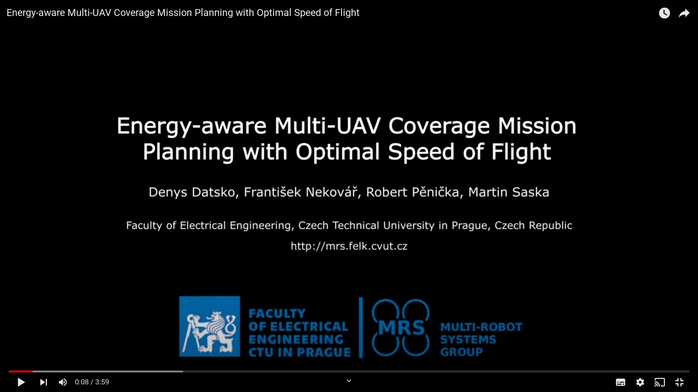

## This is a development branch and code here may be not stable. For the latest stable version, please refer to the `master` branch


# Energy-aware Multi-UAV Coverage Mission Planning with Optimal Speed of Flight
This repository contains the code for **Energy-aware Multi-UAV Coverage Mission Planning with Optimal Speed of Flight** presented in our paper [Novosad, Penicka, Vonasek CTopPRM'23](https://ieeexplore.ieee.org/document/10414185).
[](https://youtu.be/S8kjqZp-G-0)

## Citing
If you use this code in an academic context, please cite the following publication:

D. Datsko, F. Nekovar, R. Penicka and M. Saska, "Energy-aware Multi-UAV Coverage Mission Planning with Optimal Speed of Flight," in IEEE Robotics and Automation Letters, doi: 10.1109/LRA.2024.3358581. ([PDF](https://ieeexplore.ieee.org/document/10414185))

```bash
@ARTICLE{Datsko2024EAmcpp,
  author={Datsko, Denys and Nekovar, Frantisek and Penicka, Robert and Saska, Martin},
  journal={IEEE Robotics and Automation Letters}, 
  title={Energy-aware Multi-UAV Coverage Mission Planning with Optimal Speed of Flight}, 
  year={2024},
  volume={},
  number={},
  pages={1-8},
  keywords={Energy consumption;Autonomous aerial vehicles;Planning;Trajectory;Estimation;Batteries;Traveling salesman problems;Aerial Systems: Applications;Path Planning for Multiple Mobile Robots or Agents;Planning, Scheduling and Coordination},
  doi={10.1109/LRA.2024.3358581}}
```


## License
GPL-3.0 License. Copyright (C) 2022 M. Novosad, R. Pěnička, V. Vonásek (Faculty of Electrical Engineering, Czech Technical University in Prague).

This is a research code, expect that it changes often and any fitness for a particular purpose is disclaimed.

## Installation and usage
The code has been developed and tested on Ubuntu 20.04.

### Downloading the code
Clone the repository and update the submodules

`git clone https://github.com/ctu-mrs/EnergyAwareMCPP.git`

`cd EnergyAwareMCPP/`

### Compilation and dependencies
Install the following dependencies

`sudo apt-get install build-essential cmake pkg-config`

and compile in the build folder using cmake

```bash
mkdir build
cd build
cmake ..
make
```

### Running the code
After compilation you should see the coverage_mission_planner binary in the main folder. The prepared cofiguration files for exisitng maps are stored in sample_config/ where the desired parameters and map can be set. You can run the code from the folder with configs using:
`../build/coverage_mission_planner sample_algorithm_config.yaml`
The output of the run is saved in path_*.csv files where * is the number of the generated path.